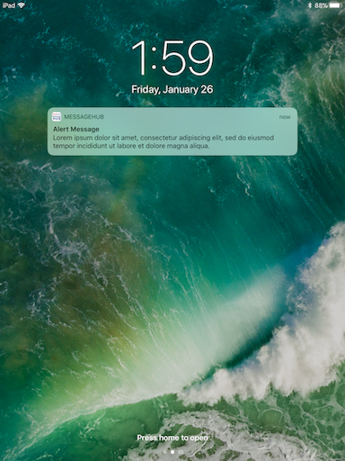
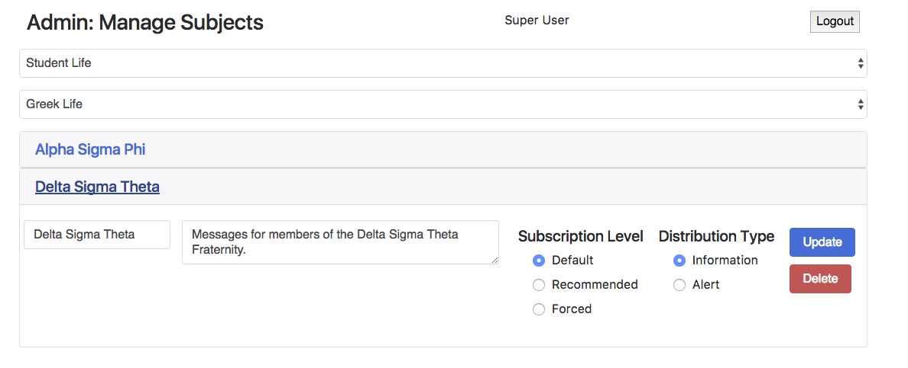

# Mobile Student Intranet Project

Message Hub System with subscription based message publishing consisting of a web portal and mobile app. Subscriptions are in an information cube hiearchy format, which is stored in a NoSQL database and managed in the web portal. Messages are relayed to subscriptions through the web portal via FCM to the mobile app. The mobile app receives messages and stores them in a local datase. The app allows indidivuals to view their messages and manage their subscriptions.

## Team
* Max Tsai
* Dawn Truelsen
* Victoria Fall

## Mobile App

### Push Notifications

### Message Views

### Subscription Views

## Web Portal

### Communicator Message Publishing

### Admin Information Cube Management

## Development

### Technologies Used

* Firebase Cloud Messaging
* React Native
* NodeJS
* ExpressJS
* MongoDB

### Architecture

### Software and System Design

Information regarding the software and system design can be found in the [design documentation](documentation/System_Design_Document.pdf).
