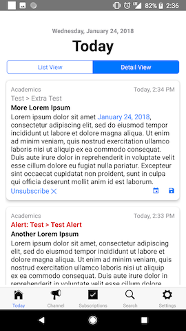
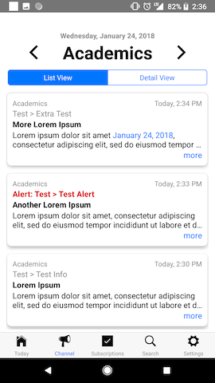

# Mobile Student Intranet Project

Message Hub System with subscription based message publishing consisting of a web portal and mobile app.

## Team
* Max Tsai
* Dawn Truelsen
* Victoria Fall

## Mobile App

### Push Notifications

### Message Views

### Subscription Views

## Web Portal

### Communicator Message Publishing

### Admin Information Cube Management

## Development

### Technologies Used

* Firebase Cloud Messaging
* React Native
* NodeJS
* ExpressJS
* MongoDB

### Architecture

### Software and System Design

Information regarding the software and system design can be found in the documentation file:
